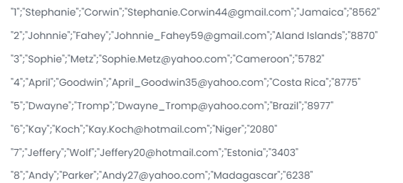

# 🚀 Challenge du 17/11/24 : Qui a la plus grosse ... machine ? - Le "Stream Performance Challenge"

**Dates** : du 17/11/24 au 01/12/24

**Difficulté** : Moyen

**Technologies** : Java 17+ 



## Description
Le challenge de cette semaine est centré sur l'utilisation des **streams Java** pour analyser et traiter une **grande quantité de données CSV**. Mais ce n'est pas tout ! En plus de résoudre le problème, nous allons également mesurer la **performance de votre machine**. Qui parmi vous aura l'ordinateur le plus rapide pour traiter ces données ? 🏎️💻

**Attention** : Le vainqueur ne sera **pas déterminé sur la puissance de sa machine**, mais sur la **qualité du code soumis**. Cependant, un classement annexe sera établi pour les **meilleurs temps d'exécution**, afin de pimenter un peu la compétition 😁!

## Objectif
Votre mission est de lire un fichier CSV (fourni dans le dépôt GitHub) et d'effectuer un calcul précis sur les données. Le fichier contient 100 000 personnes fictives, avec les informations suivantes :

- **Identifiant de la ligne**
- **Prénom**
- **Nom**
- **Email**
- **Pays**
- **Code postal**

L'objectif est de :

- **Calculer pour chaque pays le code postal le plus utilisé.**
- **Déterminer combien de personnes** dans ce pays appartiennent à ce code postal.
- **Classer la liste des pays** en fonction de la proportion de personnes appartenant à ce code postal par rapport au nombre total de personnes dans le pays.
- **Afficher les 10 premiers résultats** sous la forme :

***"1. Mexico, 0115, 45%"***
***"2. Paris, 2115, 26%"***

Le fichier contient des données générées aléatoirement, donc les résultats ne correspondent pas à la réalité. Ce qui compte ici, c'est la méthode de calcul et la performance.

### Exemple d'exécution

```dos
Lecture du fichier CSV...  
Calcul de la répartition des codes postaux par pays...  
Résultats :  
1. Mexico, 0115, 45%  
2. Paris, 2115, 26%  
...
Temps de traitement : 987 ms
```

## Détails supplémentaires

- **Structure des données** : Le fichier CSV contient plusieurs millions de lignes, ce qui nécessite une approche optimisée pour obtenir les résultats. L'utilisation judicieuse des **streams Java** est cruciale pour traiter un grand volume de données de manière efficace.

- **Classement par proportion** : Le classement doit se faire en fonction de la **proportion** de personnes appartenant au code postal le plus fréquent d'un pays, par rapport au nombre total de personnes dans ce pays. Par exemple, si un code postal couvre 45% des personnes d'un pays, il sera classé plus haut qu'un autre code postal qui ne couvre que 26% des personnes dans son pays.
- **Temps de traitement** : Bien que le classement principal soit basé sur la qualité du code, nous allons également suivre les temps d'exécution pour établir un classement secondaire et déterminer **qui a la machine la plus rapide** pour ce traitement. À vous de jouer pour optimiser votre solution et voir si vous pouvez dominer ce classement annexe !
- Fichier CSV
Le fichier CSV à utiliser sera fourni dans le **repository GitHub** associé à ce challenge. Assurez-vous de le télécharger et de l'utiliser pour vos tests.


## Récompenses
- Vainqueur : 10 pts
- 2ème : 5 pts
- 3ème : 2 pts

Rappel: Les participants accumulent des points en fonction de leur performance dans les challenges. Ces points peuvent être convertis en cartes cadeaux Prezzy, utilisables pour des achats en ligne ou en magasin dans n'importe quelle devise.

💬 **N'oubliez pas** de poser vos questions sur le serveur Discord pour toute clarification ou aide sur ce challenge. Bonne chance à tous et amusez-vous bien ! 🎉
